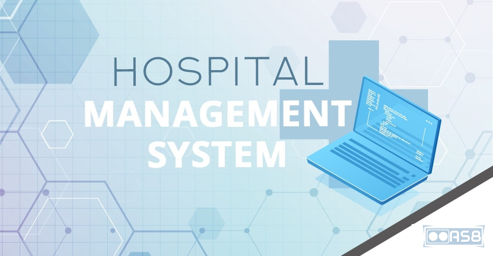
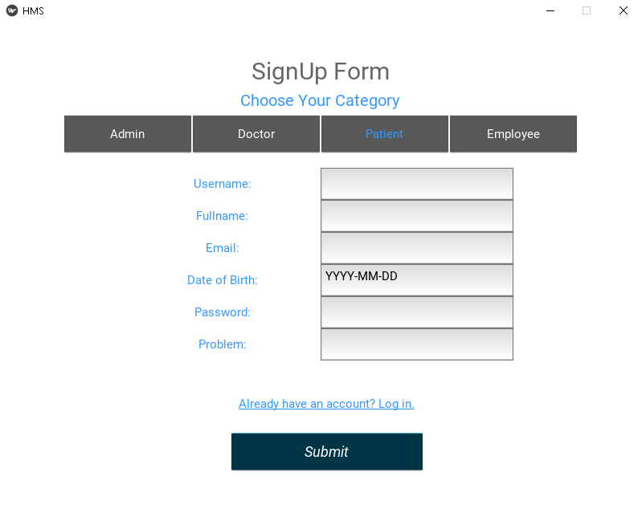
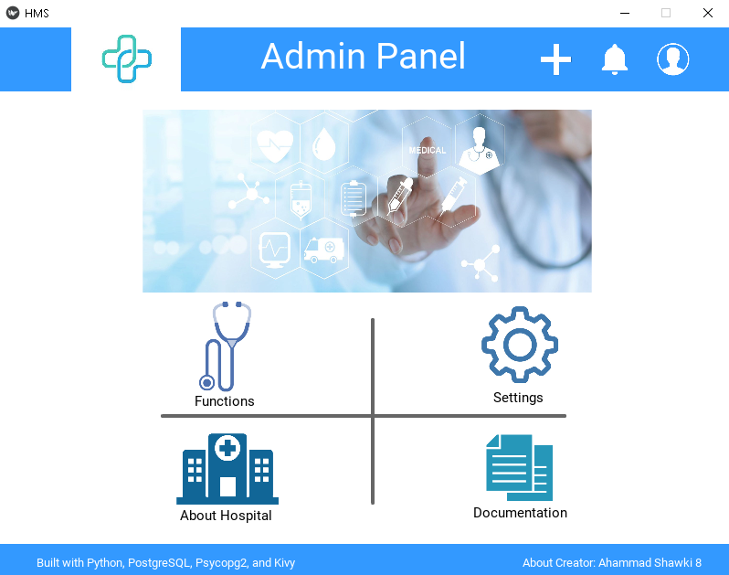
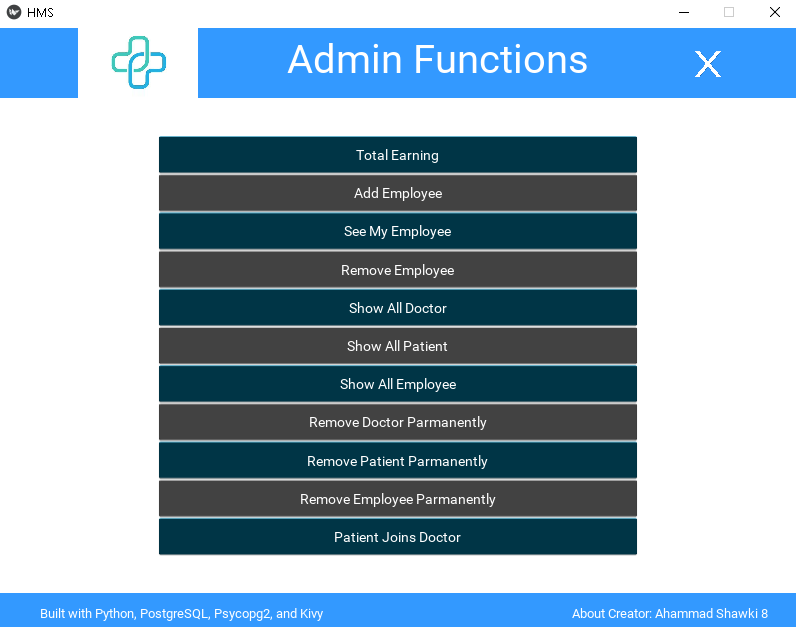
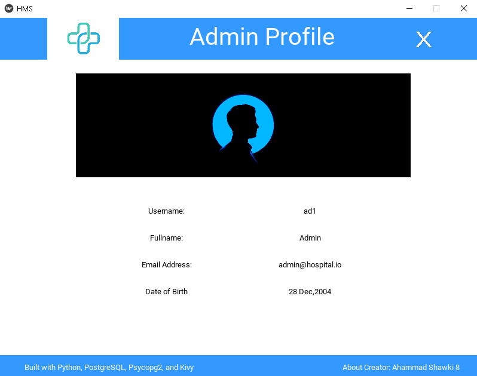

# Hospital-Management-System
🏥 The hospital management system (HMS) is integrated software that handles different directions of clinic workflows. It manages the smooth healthcare performance along with administrative, medical, legal, and financial control. That is a cornerstone for the successful operation of the healthcare facility.

This application has both the backend and the frontend part of a hospital management system. You can use the backend application if you have any frontend graphical user interface of a hospital management system. In that case, you will need to use the [main.py](main.py) file for glue code. This HMS application is completely designed in Python for specifically PostgreSQL Database.

Psycopg2 and Kivy module is used for creating the database connection and frontend part. Here different algorithms have been implanted from the developer’s point of view. It is suitable for a mid-level hospital or clinic. Working strategy plays a vital role to keep this application running smoothly.
  
*If you want to use this application in your project, first [contact me](mailto:@ahammadshawki8@gmail.com).*

 

# How to use
- Download the frameworks and libraries mentioned in [requirements.txt](requirements.txt)
- Download the [zip file](https://codeload.github.com/ahammadshawki8/Hospital-Management-System/zip/main) of this repository
- See the [demo]() video
- Run the [frontend.py](frontend.py) file
- Enjoy using this application
- If you find any difficulty or have any suggestion for future updates, create an [issue](https://github.com/ahammadshawki8/Hospital-Management-System/issues)
  
 

# Modules & Functions
## [main.py](main.py)
- Have zero function, will be used for glue code.
## [constant.py](constant.py)
- grab_constant
- set_constant

## [DB_config.py](DB_config.py)
- admin_config
- config

## [backup_restore.py](backup_restore.py)
- backup_to_csv
- restore_from_csv

## [setup_engine](setup_engine.py)
- start_program
- create_database
- delete_database
- create_admin_table
- delete_admin_table
- create_doctor_table
- delete_doctor_table
- create_patient_table
- delete_patient_table
- create_employee_table
- delete_employee_table
- add_unique_constraint
- add_check_constraint

## [login.py](login.py)
- DB_pass
- login
- signup

## [admin.py](admin.py)
- see_info
- update_db
- recent_notifications
- add_notification
- total_earning
- add_employee
- see_my_employee
- remove_employee
- show_all_doctor
- show_all_patient
- show_all_employee
- all_doctor_username
- all_patient_username
- all_employee_username
- remove_doctor_parmanently
- remove_patient_parmanently
- remove_employee_parmanently
- patient_joins_doctor
  
## [doctor.py](doctor.py)
- recent_notifications
- notify_admin
- salary
- show_all_employee
- add_employee
- see_my_employee
- remove_employee
- see_all_requested_patient
- see_all_patients_of_my_speciality
- see_my_patient
- see_patients_report
- remove_patient

## [patient.py](patient.py)
- remaining_appointment_time
- recent_notifications
- notify_admin
- cost
- add_report
- see_all_doctors_for_my_problem
- request_doctor
- remove_request
- see_my_doctors_stat
  
## [employee.py](employee.py)
- recent_notifications
- notify_admin
- salary
- isreceptionist
- appoint_doctor
- see_my_doctors

## [frontend.py](frontend.py) & [frontend.kv](frontend.kv)
- used for the frontend part, contains multiple classes and functions and also glue code.

## [resources](resorces/)
- contains images and other resources

## [backup_&_restore_folder](backup_&_restore_folder)
- contains multiple csv file which is vital for the backup and restore process of the application.
  
 

# License
Details can be found in [LICENSE](LICENSE)

 

# Some ScreenShots 

 
 

 
 

 
 

 
 

 
 

